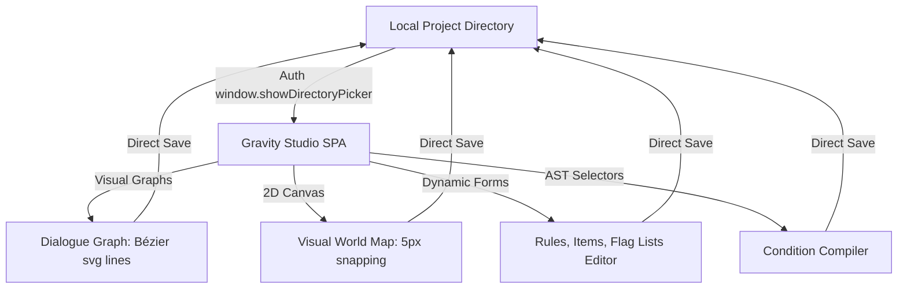

# Gravity

[](LICENSE)
[](#tech-stack)
[](#running-locally)
[](#running-locally)

A browser-native, zero-dependency data-driven text RPG engine and creator suite. Define your entire world—scenes, branch screenplays, characters, quests, items, rules, and maps—entirely in JSON with no scripting required.

**[Play the Live Demo](https://joeyprijs.github.io/gravity/)**

---

> [!NOTE]
> **🤖 100% AI-Generated Codebase**
> This entire codebase (the browser-based text RPG engine, the reactive state manager, the full-screen world map, the visual Creator Studio, and all companion unit tests) was fully researched, architected, written, documented, and optimized by Artificial Intelligence (specifically **Claude** and **Gemini**). A human served as the Project Manager, providing direction and structural reviews, but did not write a single line of the code. It is released as completely free and unencumbered public domain code.

---

## Table of Contents

- [Core Features](#core-features)
- [Gravity Studio IDE](#gravity-studio-ide)
- [Tech Stack](#tech-stack)
- [Project Structure](#project-structure)
- [Running Locally](#running-locally)
- [Core Concepts](#core-concepts) — see [docs/ARCHITECTURE.md](docs/ARCHITECTURE.md) for the full engine internals
- [Content Authoring Reference](#content-authoring-reference)
  - [Manifest — `data/index.json`](#manifest--dataindexjson)
  - [Rules — `data/rules.json`](#rules--datarulesjson)
  - [Flags — `data/flags/`](#flags--dataflags)
  - [Conditions (Logic Gates)](#conditions-logic-gates)
  - [Scenes](#scenes)
  - [NPCs & Enemies](#npcs--enemies)
  - [Items](#items)
  - [Loot Tables](#loot-tables)
  - [Missions & Quests](#missions--quests)
- [Extensible Plugin API](#extensible-plugin-api)
- [License](#license)

---

## Core Features

*   **Zero-Dependency Vanilla JS** — Runs natively in any modern web browser via ES Modules with zero bundlers, loaders, or compilations.
*   **Data-Driven Engine** — 100% of game assets (scenes, items, enemies, dialogues, quests, rules) are defined in static JSON; no JS coding is required to author a game.
*   **D&D-Style Turn-Based Combat** — Round-robin combat utilizing d20 checks, initiatives, HP, Armor Class (AC), and Action Point (AP) budgets. Supports multi-enemy encounters and auto-combat scene entries.
*   **Branching Screenplay Dialogues** — Branching conversation nodes with skill checks, item rewards, quest triggers, and stateful merchants supporting custom discounts.
*   **Interactive Maps HUD** — A dynamic scaled minimap projection in the sidebar and a full-screen scrollable coordinate map centered on the player.
*   **Dynamic Sidebar Tab Panels** — Layout-driven tab generation compiled dynamically from rules definitions, supporting custom widgets (attributes, maps).
*   **Character Creation Point-Buy** — Custom pre-game stat budgeting mapping dot-paths to player properties.
*   **Robust Schema Migration** — Base64-encoded JSON session save files carrying forward-compatible migrations to keep older saves playable on newer engine updates.

---

## Gravity Studio IDE

Gravity comes paired with **Gravity Studio** (located in `/studio`), a browser-native game creation suite. It uses the native browser **File System Access API** to directly edit your local Gravity project folder with zero backend dependencies.



### Visual Subsystems:
1.  **Dialogue Connection Node Graph:** A fully visual node-graph screenplay editor. dialogue nodes are positioned automatically on load using a custom BFS (Breadth-First Search) column-allocation layout. Options are connected to nodes by dragging from anchor dots, drawing smooth SVG curved Bézier lines.
2.  **Grid-Snapped World Map Editor:** Projects room cards absolutely in 2D space. Authors can drag-and-drop rooms snapped to a coordinate grid (`5px`) to dynamically configure the world map.
3.  **AST Logic Condition Builder:** An elegant visual tree editor for building complex condition gates (`and`, `or`, `not` nodes, gold, levels, item counts) without typing syntax.
4.  **Local Project Integrations:** Creates, renames, search-filters, and deletes files directly within the local workspace directory, maintaining active dirty tracking (`dirtyFiles` Set) with quick batch saves (`Ctrl/Cmd + S`).

---

## Tech Stack

| Component | Choice |
| :--- | :--- |
| **Language** | Vanilla JavaScript (ESModules) |
| **Markup & Layout** | HTML5 (Dynamic layout viewports) |
| **Styles (CSS)** | Plain CSS3 (Custom properties, CSS variables) |
| **Testing Frame** | Node.js native test runner (zero external dependencies) |
| **Local I/O (Studio)** | Native File System Access API |

---

## Project Structure

```
gravity/
├── index.html               # Main game HTML entry
├── css/
│   └── styles.css           # Premium gaming styles & properties
├── src/
│   ├── core/
│   │   ├── engine.js        # Subsystem orchestrator & startup validator
│   │   ├── state.js         # Reactive StateManager & base64 serializer
│   │   ├── config.js        # Global elements, action keys, and enums
│   │   └── utils.js         # DOM helpers & dot-path traversal utilities
│   ├── systems/
│   │   ├── actions.js       # Composable action pipeline handlers
│   │   ├── combat.js        # D&D turn-based combat & game-over loops
│   │   ├── condition.js     # Recursive AST logical evaluation compiler
│   │   ├── dialogue.js      # NPC branch screenplays & merchant trade panels
│   │   ├── dice.js          # roll() and NdF[+/-M] damage roll parsers
│   │   ├── narrative.js     # Chronological log & scroll manager
│   │   ├── quests.js        # Mission lifecycle and reward processor
│   │   └── scene.js         # Room renderer, skill drops, and DC escalators
│   ├── ui/
│   │   ├── ui.js            # Reactive view controller & tab nav constructor
│   │   ├── inventory-ui.js  # Inventory item lists & equipped slots
│   │   ├── quest-ui.js      # Active & Completed quest log panels
│   │   └── chest-ui.js      # Chest vault deposit/withdraw interfaces
│   ├── world/
│   │   └── map.js           # Minimap scaling & centering scroll world map
│   ├── screens/
│   │   └── char-creation.js # Character allocation pre-game point-buy
│   └── plugins/
│       ├── curator.js       # Museum curation & reputation plugin
│       └── curator/locales/ # Plugin locale namespaces
├── tests/                   # Synchronous Node unit tests (npm test)
│   ├── char-creation.test.js
│   ├── combat.test.js
│   ├── condition.test.js
│   ├── dice.test.js
│   ├── display.test.js
│   ├── reputation.test.js
│   └── state.test.js
├── schemas/                 # Project JSON Schema validation files
│   ├── item.schema.json
│   ├── scene.schema.json
│   └── npc.schema.json
├── studio/                  # Gravity Studio IDE
│   ├── index.html           # Studio HTML entry
│   ├── css/                 # Studio custom styles
│   └── js/                  # Form builders, nodes, logic trees compiler
└── data/                    # Game story directories (scenes, items, etc.)
```

---

## Running Locally

Gravity requires **no compile, build, or npm installation steps**. To resolve ES Module CORS restrictions, serve the directory using any lightweight server:

```bash
# Option A: Python server
python3 -m http.server 3000

# Option B: Node serve
npx serve .
```

*   **Play the Game:** Open `http://localhost:3000` in your browser.
*   **Open the Studio:** Open `http://localhost:3000/studio` in your browser.
*   **Executing Unit Tests:** Run the synchronous Node unit test runner:
    ```bash
    npm test
    ```

---

## Core Concepts

The engine operates on a unidirectional, event-driven loop driven by the **Trinity**:

```
[ Conditions (Gates) ] ➔ Allow/Deny ➔ [ Options / Scenes ] ➔ Trigger ➔ [ Actions (Mutations) ] ➔ Modify ➔ [ Flags / State ] ➔ Updates [ Conditions ]
```

*   **Flags (State):** Persisted key-value states inside `gameState` that record what the player has accomplished (e.g. `door_unlocked: true`).
*   **Conditions (Gates):** Logic trees that evaluate the flags, items, gold, level, or skills to show or hide scene options, dialogue paths, and room texts.
*   **Actions (Mutations):** Pipelines of changes executed when a choice is made (loot, combat, dialogue, set_flag, navigate).

---

## Content Authoring Reference

### Manifest — `data/index.json`
The central project registry. Every asset must be registered here:

```json
{
  "worldMapSize": { "width": 3000, "height": 2000 },
  "rules": "data/rules.json",
  "flags": {
    "dungeon": "data/flags/dungeon.json"
  },
  "scenes": {
    "dungeon_start": "data/scenes/dungeon/start.json"
  },
  "items": {
    "rusty_sword": "data/items/rusty_sword.json"
  },
  "npcs": {
    "goblin_guard": "data/npcs/goblin_guard.json"
  },
  "missions": {
    "escape_dungeon": "data/missions/escape_dungeon.json"
  },
  "tables": {
    "basic_loot": "data/tables/basic_loot.json"
  }
}
```

---

### Rules — `data/rules.json`
Configures character values, inventory orders, pre-game budgets, and sidebar panels:

```json
{
  "startingScene": "dungeon_start",
  "merchantSellRatio": 0.5,
  "unequipApCost": 1,
  "restHealAmount": 10,
  "snackHealAmount": 2,
  "levelUpHpBonus": 5,
  "xpPerLevel": 100,
  "fallbackWeapons": {
    "player": "unarmed_strike",
    "enemy": "enemy_claw"
  },
  "itemTypeOrder": {
    "Weapon": 0, "Spell": 1, "Armor": 2, "Consumable": 3, "Flavour": 4
  },
  "playerDefaults": {
    "name": "", "level": 1, "xp": 0,
    "resources": {
      "hp": { "current": 10, "max": 10 },
      "ap": { "current": 3, "max": 3 },
      "gold": 10
    },
    "attributes": { "ac": 10, "initiative": 0 },
    "inventory": [],
    "equipment": { "Head": null, "Torso": null, "Left Hand": null, "Right Hand": null }
  },
  "customAttributes": [
    { "id": "perception", "default": 0 },
    { "id": "stealth", "default": 0 }
  ],
  "charCreation": {
    "pointBudget": 3,
    "stats": [
      { "id": "resources.hp.max", "localeKey": "maxHp", "bonusPerPoint": 2, "min": 0 },
      { "id": "attributes.perception", "localeKey": "perception", "bonusPerPoint": 1, "min": 0 }
    ]
  },
  "tabs": [
    { "id": "inventory-tab", "localeKey": "ui.tabInventory", "default": true },
    { "id": "quests-tab", "localeKey": "ui.tabQuests" },
    { "id": "attributes-tab", "localeKey": "ui.tabAttributes", "widget": "attributes" },
    { "id": "map-tab", "localeKey": "ui.tabMap", "widget": "map" }
  ]
}
```

---

### Flags — `data/flags/`
Declared inside area files and merged into a single flat key namespace at boot:

```json
{
  "door_unlocked": false,
  "defeated_goblin_guard": false
}
```

---

### Conditions (Logic Gates)
Boolean nodes evaluated inside option, dialogue, description, or skill blocks:

```json
{
  "and": [
    { "flag": "guard_distracted", "value": true },
    { "not": { "flag": "defeated_goblin_guard", "value": true } }
  ]
}
```

*   **Leaf Shapes:**
    *   `{ "flag": "name", "value": true }` — Matches boolean flag states.
    *   `{ "item": "potion", "count": 2 }` — Evaluates if player inventory count is met.
    *   `{ "gold": 50 }` or `{ "gold": { "less_than": 10 } }` — Evaluates gold count.
    *   `{ "level": 3 }` — Evaluates player level.
    *   `{ "mission": "escape", "status": "active" }` — Matches quest lifecycle.
    *   `{ "stealth": 2 }` — Matches player skill attribute thresholds.

---

### Scenes
A location the player can visit, supporting conditional text blocks, option grids, and skill checks:

```json
{
  "title": "Cellar room",
  "region": "dungeon",
  "mapDefinitions": {
    "top": 245, "left": 175, "width": 50, "height": 60, "background": "rgba(60,40,20,0.9)"
  },
  "descriptionHook": "museumChestContents",
  "supportsExhibits": true,
  "displays": [
    { "id": "cellar_pedestal", "name": "Old Altar Pedestal", "item": "rusty_sword" }
  ],
  "description": [
    {
      "text": "The wooden door stands wide open to the north.",
      "condition": { "flag": "door_unlocked", "value": true }
    },
    {
      "text": "A heavy wooden door stands locked to the north."
    }
  ],
  "options": [
    {
      "text": "Unlock the door",
      "log": "You slide the key into the lock and turn it.",
      "condition": { "flag": "door_unlocked", "value": false },
      "requirements": { "item": "cellar_key" },
      "actions": [
        { "type": "set_flag", "flag": "door_unlocked", "value": true },
        { "type": "navigate", "destination": "dungeon_corridor" }
      ]
    }
  ],
  "skills": [
    {
      "text": "Look Around",
      "skillCheck": "perception",
      "items": [
        { "item": "cellar_key", "amount": 1, "dc": 10, "increment": 1 },
        { "table": "basic_loot", "dc": 14, "increment": 2, "itemDrops": 2 }
      ]
    }
  ]
}
```

---

### NPCs & Enemies
NPCs define aggressive monsters to fight, branching conversations, or shop merchants:

```json
{
  "name": "Goblin Guard",
  "description": "A snarling creature wearing rusted scale armor.",
  "isMerchant": true,
  "storeExitText": "Be gone, traveler.",
  "carriedItems": [
    { "item": "healing_potion", "amount": 3 }
  ],
  "attributes": {
    "healthPoints": 8,
    "armorClass": 8,
    "actionPoints": 3,
    "initiative": 1,
    "xpReward": 50
  },
  "equipment": { "Right Hand": "rusty_sword" },
  "conversations": {
    "start": {
      "npcText": "Stop right there! Who goes there?",
      "responses": [
        { 
          "text": "[Persuade] I mean no harm.",
          "skillCheck": "charisma", "dc": 12, "increment": 2,
          "actions": [ { "type": "goToConversation", "node": "friendly" } ],
          "onFailure": [ { "type": "goToConversation", "node": "hostile" } ]
        },
        { "text": "[Attack] Prepare to fight!", "actions": [ { "type": "leave" }, { "type": "combat", "enemies": ["goblin_guard"] } ] }
      ]
    },
    "friendly": {
      "npcText": "Fine. Let's see what you have.",
      "responses": [
        { "text": "Let's trade.", "actions": [ { "type": "trade" } ] }
      ]
    },
    "hostile": {
      "npcText": "Die, human!",
      "actions": [ { "type": "combat", "enemies": ["goblin_guard"] } ]
    }
  }
}
```

---

### Items
Items define weapons, shields, spells, armor protections, or consumables:

```json
{
  "name": "Healing Potion",
  "type": "Consumable",
  "description": "A glowing red fluid in a glass vial.",
  "value": 10,
  "actionPoints": 1,
  "attributes": {
    "healingAmount": "1d8+2",
    "teleportScene": "dungeon_sanctuary"
  }
}
```

---

### Loot Tables
Loot tables support probability-weighted random item drops:

```json
{
  "entries": [
    { "item": "gold", "amount": 10, "weight": 5 },
    { "item": "healing_potion", "weight": 2 },
    { "item": "rusty_sword", "weight": 1 }
  ]
}
```

---

### Missions & Quests
Missions register rewards, descriptions, and statuses tracked by the quest system:

```json
{
  "name": "Escape the Dungeon",
  "description": "Unlock the gates and find a way back to the surface.",
  "missionRewards": {
    "xp": 100,
    "gold": 50
  }
}
```

---

## Extensible Plugin API

Gravity includes a runtime plugin framework. Add custom JS modules to the `plugins` array in `data/index.json`. The engine loads them dynamically upon initialization:

```javascript
// data/index.json
"plugins": ["plugins/custom_teleport.js"]
```

Plugins expose a default function receiving the active `RPGEngine` instance, allowing them to register custom actions and dynamic narrative description hooks:

```javascript
// plugins/custom_teleport.js
export default function(engine) {
  // 1. Register a custom action pipeline node
  engine.registerAction('teleport_home', (action, engine) => {
    engine.log('System', 'A magical energy sweeps you away...', 'loot');
    engine.renderScene('home_bedroom');
  });

  // 2. Register a description hook callback
  engine.registerDescriptionHook('myCustomText', (engine) => {
    return ' The air feels damp and strange here.';
  });
}
```

---

## License

This is free and unencumbered software released into the public domain. For more details, see the [LICENSE](LICENSE) file.
